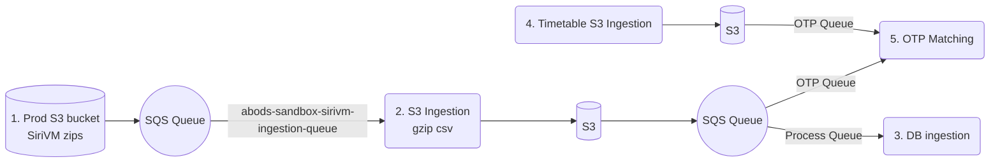

# ABODS ITM Sandbox

Repository relating to the Analyse Bus Registration Data service that is offered by DfT (Department for Transport). 
Specifically this contains code relating to the Backend ITM (Integrated Data Management) Services.

## Category

Supporting application backend microservices.

## Tech Stack
 - Liquibase
 - Python
 - AWS SAM (Serverless Application Model)

## Ingestion Pipelines

### 1. Prod S3 Bucket SiriVM zips
The SiriVM AVL gzip files obtained from BODS. 

When the S3 bucket's got the latest AVL data every 10 seconds, it sends a message to abods-sandbox-sirivm-ingestion-queue which will be received by step-2 S3 Ingestion and initiates the ingestion process

### 2. S3 Ingestion
S3 Ingestion's lambda handler function 
- receives SQS message from abods-sandbox-sirivm-ingestion-queue
- obtains AVL data gzip file from s3 bucket
- parses and extracts AVL data in xml format and write it to csv format and into a gzip file
- uploads converted AVL data in gzip file to s3 bucket
- sends message to process queue trigger 3. DB Ingestion 
- sends message to otp queue to trigger 5. OTP Matching function

### 3. DB Ingestion
DB Ingestion's lambda handler function
- receives SQS message from process queue
- connects to database and retrieves the AVL batch table
- truncates staging avl positions table
- rewrites staging table with avl data extracted from S3 ingestion
- updates AVL batch table with data from staging table

### 4. Timetable S3 Ingestion
Timetable data is updated every 30 minutes.

Timetable S3 Ingestion's lambda handler function
- connects to database and extract data from specific columns for OTP matching from timetable
- writes the extracted data into json format and loads it to S3 bucket
- sends message to otp queue to trigger 5. OTP Matching function

### 5. OTP Matching
OTP Matching's lambda handler function
- receives SQS message from otp queue
- retrieves and read AVL data in csv format from s3 bucket
- matches position data to the timetable data
- calculates the distance between bus position and the stop and get the bus actual departure time to analyse bus on time performance
- connects to the database
- updates the timetable with the bus punctuality 
- writes AVL last positions data to s3 bucket
