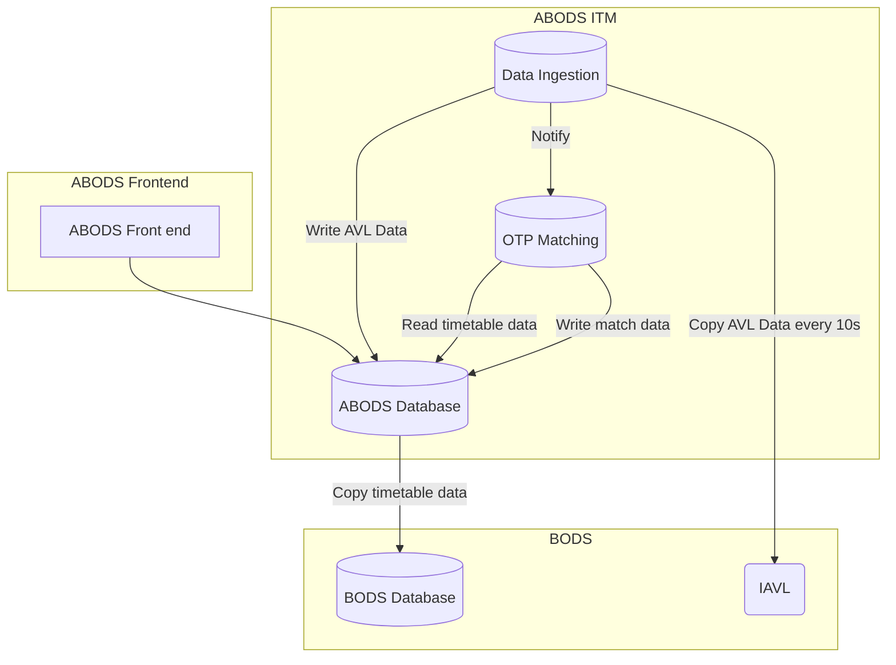

# Architecture Overview

## High-Level Architecture

Below is a high-level overview of the architecture for the live workload:

## Data Storage and Processing

- **Timetable Data:** Copied from the BODS database and processed in the ABODS database to support OTP matching.
- **Summary Data:** Once daily OTP matching is complete, summary data is generated so that statistics can be generated more efficiently.

For more details, refer to [Data](./Data.md).

## Data Ingestion

- **Source:** Data is retrieved from the IAVL system.
- **Storage:** Stored in S3 for accessibility by OTP matching and pushed into the ABODS database.

For further details, see [Data Ingestion](./Data%20Ingestion.md).

## On Time Performance (OTP) Matching

- **Inputs:** Uses concrete timetable data from the ABODS database and AVL data copied from Data Ingestion.
- **Processing:** Generates matching data, which is then stored in the ABODS database.

Learn more in [OTP Matching](./OTP%20Matching.md).
