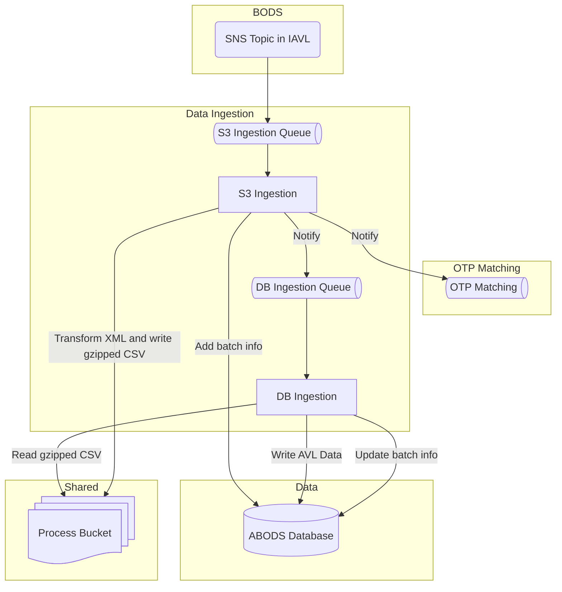

# Data Ingestion

## Ingestion Pipeline Overview

The data ingestion system processes Automatic Vehicle Location (AVL) data from IAVL, storing the data in the ABODS database and preparing it for OTP matching.

## IAVL Notifications

ABODS receives notifications through an SNS topic to retrieve data from IAVL:

- **Frequency**: Notifications arrive every 10 seconds
- **Payload**: Each message contains the S3 key of the latest AVL file to retrieve
- **Destination**: Messages are placed on the S3 ingestion queue in ABODS

## S3 Ingestion

📄 **Source Code**: [S3 Ingestion Lambda function](../ingestion_pipelines/sirivm_s3_ingestion_function/sirivm_s3_ingestion_function/app.py)

This process triggers when a message arrives on the S3 ingestion queue. The queue is FIFO (First-In-First-Out) to ensure data is processed in chronological order.

### Process Flow

1. **Batch Tracking**:
   - Creates a new record in the database `batch` table to track this ingestion process

2. **Data Retrieval and Transformation**:
   - Pulls the AVL XML data from the IAVL S3 bucket
   - Transforms the XML data into gzipped CSV format
   - Stores the transformed data in the ABODS process bucket

3. **Notifications**:
   - Sends a message to the DB ingestion queue to trigger the next step
   - Notifies all [OTP matching queues](OTP%20Matching.md) about the new data

4. **Status Update**:
   - Updates the `batch` record in the database with current processing status

## DB Ingestion

📄 **Source Code**: [DB Ingestion Lambda function](../ingestion_pipelines/sirivm_db_ingestion_function/sirivm_db_ingestion_function/app.py)

This process triggers when a message arrives on the DB ingestion queue.

### Process Flow

1. **Data Retrieval**:
   - Retrieves the gzipped AVL data from the ABODS process bucket

2. **Initial Batch Update**:
   - Updates the `batch` record in the database to indicate processing has begun

3. **Staging Data Preparation**:
   - Clears any existing data in the `staging_avl_positions_historic` table for the current batch
   - This ensures clean processing if the same batch is processed multiple times

4. **Data Loading**:
   - Copies the gzipped CSV data into the `staging_avl_positions_historic` table

5. **Database Procedure Call**:
   - Executes the [`load_avl_tables_historic`](../liquibase/procedures/load_avl_tables_historic.sql) stored procedure
   - This procedure:
     - Copies the current batch data into the permanent `SiriVMPositions` table
     - Truncates the staging table to prepare for future batches

6. **Status Update**:
   - Updates the `batch` record with completion status
