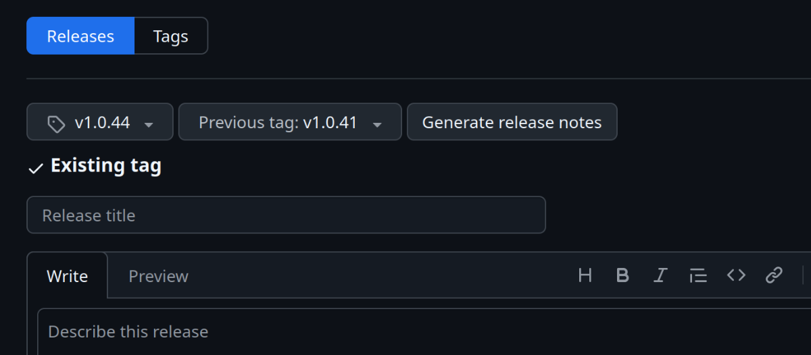

# Deployment Guide

This guide describes the deployment process across all environments in our CI/CD pipeline.

## Environments

We maintain 5 environments in our deployment pipeline:

| Environment  | Branch                                                                                                      | Purpose                 | Notes                           |
|--------------|-------------------------------------------------------------------------------------------------------------|-------------------------|---------------------------------|
| `sandbox`    | `sandbox`                                                                                                   | Development testing     | Primary development environment |
| `dev`        | `dev`                                                                                                       | Development             | Currently underutilized         |
| `test`       | `test`                                                                                                      | Testing                 | Currently underutilized         |
| `uat`        | `main`                                                                                                      | User Acceptance Testing | Pre-production verification     |
| `prod`       | None (deployed using [Github Releases](https://github.com/department-for-transport-BODS/abods-itm/releases) | Production              | Live environment                |

## Deployment to Sandbox

The sandbox branch is the default branch, and our primary development branch. When Pull Requests are merged to sandbox, deployment will be triggered

To test changes before merging a PR. Use the [build application](https://github.com/department-for-transport-BODS/abods-itm/actions/workflows/build.yml) GitHub Action for your desired branch.

> [!IMPORTANT]
> Database migrations will not be applied automatically in sandbox - you must connect to the database and run changes manually

## Standard Deployment Process (Path to Live)

### Step 1: Update VERSION File

Before deploying beyond dev, increment the version number in the [VERSION](../VERSION) file.

Quick method: Edit directly in the [GitHub UI](https://github.com/department-for-transport-BODS/abods-itm/edit/sandbox/VERSION)

### Step 2: Deploy to Each Environment

> [!WARNING]
> When deploying to most environments, we create a PR for visibility, but must merge them **OFFLINE** and push the result.
> The PR UI is configured to require squash-and-merge which will cause conflicts on future deployments.
> Required checks still need to pass before you are allowed to push the merge.

#### Deploy to DEV

1. Create a [sandbox → dev PR](https://github.com/department-for-transport-BODS/abods-itm/compare/dev...sandbox?quick_pull=1&title=sandbox+-%3E+dev)
2. Wait for checks to pass
3. **Merge offline** using:
    ```bash
    # Save any local changes
    git stash push -m "Unfinished changes before deploy"
    
    # Update dev branch
    git checkout dev
    git pull
    git fetch
    git merge origin/sandbox
    git push
    ```

> [!IMPORTANT]
> You must wait for the build to complete before deploying to subsequent environments.
> Deployment assets are created here.

The pipeline will create a tag based on the VERSION file that will be used in the production deployment.

#### Deploy to TEST

1. Create a [dev → test PR](https://github.com/department-for-transport-BODS/abods-itm/compare/test...dev?quick_pull=1&title=dev+-%3E+test)
2. Wait for checks to pass
3. **Merge offline** using:
    ```bash
    # Save any local changes
    git stash push -m "Unfinished changes before deploy"
    
    # Update test branch
    git checkout test
    git pull
    git fetch
    git merge origin/dev
    git push
    ```
4. Approve the [deployment workflow](https://github.com/department-for-transport-BODS/abods-itm/actions/workflows/deploy.yml)

#### Deploy to UAT

1. Create a [test → main PR](https://github.com/department-for-transport-BODS/abods-itm/compare/main...test?quick_pull=1&title=test+-%3E+main)
2. Wait for checks to pass
3. **Merge offline** using:
    ```bash
    # Save any local changes
    git stash push -m "Unfinished changes before deploy"
    
    # Update main branch
    git checkout main
    git pull
    git fetch
    git merge origin/test
    git push
    ```
4. Approve the [deployment workflow](https://github.com/department-for-transport-BODS/abods-itm/actions/workflows/deploy.yml)

#### Deploy to PRODUCTION

> [!IMPORTANT] 
> - Complete a team go/no-go discussion before production deployment

1. Create a [new GitHub release](https://github.com/department-for-transport-BODS/abods-itm/releases/new)
2. Select the appropriate tag (usually the latest)
3. Select the [latest release](https://github.com/department-for-transport-BODS/abods-itm/releases/latest) as the previous tag and click "Generate release notes"
4. Publish the release
5. Approve the [deployment workflow](https://github.com/department-for-transport-BODS/abods-itm/actions/workflows/deploy.yml)



## Production Hotfixes

In emergencies when the regular path to live contains code not ready for production:

> [!WARNING]
> - Use hotfixes only when necessary - prefer fixing forward whenever possible
> - Requires permission to force push the dev branch
> - This process may impact development work

### Create and Implement Hotfix

1. Create a hotfix branch from the latest production tag:
    ```bash
    git stash push -m "Unfinished changes before hotfix"
    git fetch
    git checkout -b hotfix/my-hotfix-branch-name vx.y.z
    ```
2. Make required changes to fix the issue
3. **Important:** Update the [VERSION](../VERSION) file to a version higher than current dev
4. Follow normal development practices, but don't merge the PR yet

### Generate Deployment Assets

1. Save the current state of the dev branch:
    ```bash
    git fetch
    git checkout -b origin/dev DEV-BRANCH-BEFORE-HOTFIX-DEPLOYMENT
    git push
    ```
2. Force-push the hotfix to dev:
    ```bash
    git checkout dev
    git reset --hard hotfix/my-hotfix-branch-name
    git push --force-with-lease
    ```

This will trigger the [build workflow](https://github.com/department-for-transport-BODS/abods-itm/actions/workflows/build.yml) and create properly tagged assets for production.

### Deploy Hotfix to Production

Follow the regular "Deploy to PRODUCTION" steps above.

### Cleanup After Hotfix

1. Merge your hotfix PR into the sandbox branch
2. Restore the dev branch to its previous state:
    ```bash
    git checkout dev
    git reset --hard DEV-BRANCH-BEFORE-HOTFIX-DEPLOYMENT
    git push --force-with-lease
    git push origin --delete DEV-BRANCH-BEFORE-HOTFIX-DEPLOYMENT
    ```
