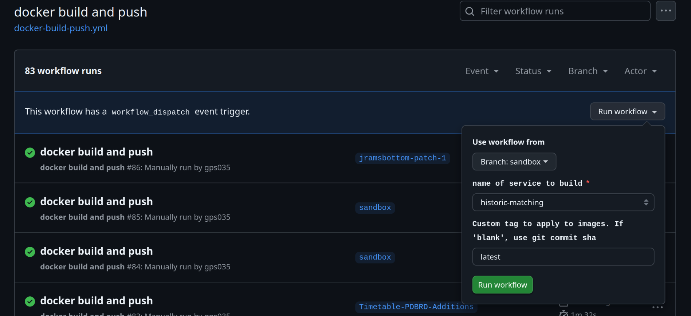
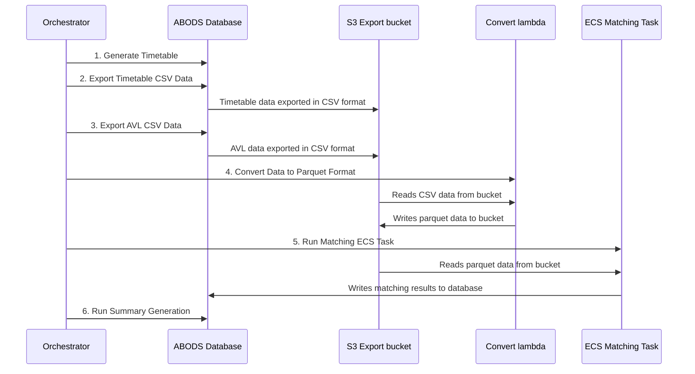

# Historic Matching

## Overview

Historic matching allows re-processing and matching of vehicle location data against timetable data for past dates. This can be necessary when:
- Matching logic has been updated
- A matching outage occurred
- Data corrections are needed

### Prerequisites
- [AVL ingestion](Data%20Ingestion.md) must be successful for the target date.
- The following day's AVL data is also required (for services running past midnight).

## Task Image Updates

> [!WARNING]  
> The CI build does not automatically update the historic matching image.  
> To use updated matching logic or changes to the historic matching task, you must manually build the ECS task image.

### Steps to Update the Image
1. Navigate to the workflow: [docker-build-push.yml](https://github.com/department-for-transport-BODS/abods-itm/actions/workflows/docker-build-push.yml)
2. Select the appropriate branch (`sandbox` if the code has been merged)
3. Set the image tag to `latest` (this is **required** for the new image to be used)
4. Run the workflow



## Process Overview

Historic matching consists of several sequential steps:



## Orchestrated Process

For efficiency, use the automated script to process multiple dates unattended:

📄 **Script**: [historic_matching.py](../scripts/historic_matching.py)

This script should be copied to the `abods-$env-bastion` instance (e.g. using an editor like `nano`) and executed in an SSM session on the instance.
Ensure the instance IAM role has the necessary permissions (see [bastion_policy.json](../scripts/bastion_policy.json)).

### Running the Script

```shell
# Only needs to be done once
chmod +x ./historic_matching.py
```

To prevent termination when the session ends, use GNU screen:

```shell
# Start a screen session named 'matching' with a large scroll back buffer to see logs easier
screen -h 10000 -S matching

# You can use multiple named sessions, if you need to do more than one thing on the instance
# CTRL-A, d to detach from the screen session
# CTRL-A, ESC to enter copy mode, which lets you scroll up
# More examples here https://wiki.archlinux.org/title/GNU_Screen#Common_Commands

# Reconnect to the screen session later
screen -r matching
```

To start the script:

```shell
AWS_DEFAULT_REGION=eu-west-2 ./historic_matching.py
```
The script will prompt you for more information, like the date range, and then will run the process as described below.

> [!IMPORTANT]  
> Remember to update the script on the instance whenever changes are made, as it is not deployed in CI.

## Manual Process

To manually re-match data for a specific date, follow these steps.

> [!NOTE]  
> - Examples below are for the 4th December 2024, and the sandbox environment
> - For all database procedure calls, connect to the ABODS Database as described in [Getting Started](Getting%20Started.md)

### 1. Generate Timetable (Optional)

Use the [`generate_timetable`](../liquibase/procedures/generate_timetable.sql) procedure to create timetable data for the target date.

> [!WARNING]
> - Running this for multiple days concurrently is untested
> - This process temporarily blocks live OTP matching. Monitor SQS queues before running again to avoid backlogs.

```sql
-- In a database session

CALL public.generate_timetable('2024-12-04');
```

### 2. Export Timetable CSV Data

Use the [`historic_timetable_export`](../liquibase/procedures/historic_timetable_export.sql) procedure to export timetable data to the export bucket:

```sql
-- In a database session

CALL public.historic_timetable_export('2024-12-04');
```

### 3. Export AVL CSV Data

Use the [`historic_avl_export`](../liquibase/procedures/historic_avl_export.sql) procedure to export AVL data for both the target date and the following day the export bucket:

```sql
-- In a database session

CALL public.historic_avl_export('2024-12-04');

-- Remember the next day's data too
CALL public.historic_avl_export('2024-12-05');
```

### 4. Convert Data to Parquet Format

Trigger the 📄 [Convert to Parquet Lambda Function](../ingestion_pipelines/convert_to_parquet_function/convert_to_parquet_function/app.py) using the 📄 [historic-matching-data-conversion.sh](../scripts/historic-matching-data-conversion.sh) script:

```shell
# From the repository root
# First assume a role with appropriate permissions for the target environment
# Pass the date, and the target environment

./scripts/historic-matching-data-conversion.sh 2024-12-04 sandbox

# Remember the next day's data too
./scripts/historic-matching-data-conversion.sh 2024-12-05 sandbox
```

**Configurable Features** (edit the script to modify them):
- Converts both timetable and AVL data.
- Prevents overwriting existing Parquet files.

### 5. Run Matching ECS Task

Execute the historic matching ECS task using the 📄 [historic-matching.sh](../scripts/historic-matching.sh) script:

```shell
# From the repository root
# First assume a role with appropriate permissions for the target environment
# Pass the date, and the target environment

./scripts/historic-matching.sh 2024-12-04 sandbox
```

📄 **Key Components**:
- **Dockerfile**: [Dockerfile](../docker/historic-matching/Dockerfile)
- **Entrypoint**: [historic_matching.py](../ingestion_pipelines/sirivm_otp_matching_function/sirivm_otp_matching_function/historic_matching.py)
- **Execution Script**: [historic-matching.sh](../scripts/historic-matching.sh)

**Debugging Tips**:
- Setting the log level to DEBUG will produce a vast number of logs
- For targeted debugging, you can set `DEBUG_GROUP_IDS` in the execution script to a comma-separated list of group IDs
- This enables debug logging only for specific groups

**Performance Considerations**:
- Multiple matching tasks can run concurrently
- Production environment has been tested with 5 concurrent tasks
- Monitor live OTP matching performance if testing higher concurrency levels

### 6. Run Summary Generation

Finally, run the summary generation procedure:

> [!WARNING]
> - Running summaries for multiple days concurrently is untested.
> - This procedure temporarily blocks OTP page access; run this outside business hours in production.

```sql
-- In a database session

CALL public.historic_matching_summary_generation('2024-12-04');
```

> [!WARNING]  
> - Running summaries for multiple days concurrently is untested.  
> - This procedure temporarily blocks OTP page access; schedule it outside business hours in production.

