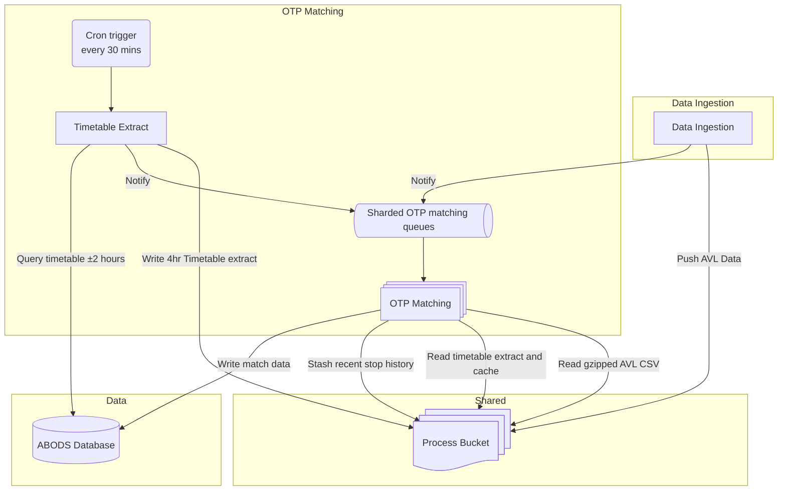

# On Time Performance (OTP) Matching

## Timetable Extract

This process runs every 30 minutes via a cron trigger.

📄 **Source Code**: [Timetable S3 Generation lambda function](../ingestion_pipelines/sirivm_timetable_s3_generation_function/sirivm_timetable_s3_generation_function/app.py)

### Process Overview

1. Extracts 4 hours of timetable data (±2 hours from current time) from the ABODS database
2. Converts data into an optimized format for efficient timetable lookup during OTP matching
3. Writes JSON data to the process S3 bucket
4. Notifies all OTP processing queues of the updated extract

### Extract Data Structure

The S3 data uses the following structure:

#### Key Format
- Standard format: `operator_noc|line_name|journey_ref|date_of_journey` (known as `group_id`)
  - `date_of_journey` refers to the service date, which may be the day before the expected departure time
- Special case: When multiple journeys share the same group ID but have different directions, the key becomes `group_id|direction`. Due to data quality issues with direction values, direction is only added to disambiguate in cases where multiple journeys would otherwise share the same key

#### Values
- Each key maps to lists of expected stop data (indexed by stop ID) for a given journey

#### Stop Indexing
Due to data quality issues with the `stop_index` value in the ABODS database, we recalculate stop indexes in this extract:
- Stops are ordered chronologically by expected departure time
- Indexes always start at 1 (even when original data might start at higher values)
- This ensures consistency when original data has journeys starting at indexes > 1 to align with displayed timetables

## OTP Matching

> [!NOTE]
> The matching process described below can be repeated or corrected for historical data, provided that [AVL ingestion](Data%20Ingestion.md) was successful for the date(s) in question.
> For details on correcting past data, see the [Historic Matching documentation](Historic%20Matching.md).

📄 **Source Code**: [OTP matching lambda function](../ingestion_pipelines/sirivm_otp_matching_function/sirivm_otp_matching_function/app.py)

### Sharding System

To distribute processing load, the system shards lambdas by operator:

- **Configuration**: Current shard mappings are defined in 📄 [shards.py](../ingestion_pipelines/sirivm_otp_matching_function/sirivm_otp_matching_function/shards.py)
- **New operators**: Operators that had no recent data at time of last rebalancing are assigned to a shard based on the hash of their NOC value
- **Rebalancing**: possible using 📄 [shard_balancing.py](../scripts/shard_balancing.py) but requires these manual steps on deployment:
  - Temporary halt of OTP matching
  - Consolidation of stop history from all shards
  - Replacing shard stop history with the combined history
  - This has only been performed once due to its complexity

### Workflow

#### On Cold Start or Timetable Extract Update
- Retrieves the latest timetable extract from S3
- Caches the extract in memory for efficient lookups

#### On New AVL Data

> [!NOTE]
>  The OTP matching queue is FIFO (First-In-First-Out) to ensure data is processed in chronological order.

1. Retrieves stop history data from S3 (saved by previous invocations)
2. Performs housekeeping:
   - Removes journeys last seen more than 2 hours ago from stop history
3. Retrieves and decompresses gzipped AVL data from the process bucket
4. Filters AVL data to only include operators assigned to this shard
5. For each AVL record:
   - Attempts to match it to the timetable extract (see algorithm below)
6. Writes confirmed match data to the ABODS database
7. Updates the `batch` database table with completion status
8. Updates stop history and saves it back to the process bucket for future use

> [!TIP]
> The code produces extensive logs at debug level
> Similar to historic matching, it would be straightforward to add targeted debug logging for specific group IDs via an environment variable

### Matching Algorithm

#### 1. Timetable Lookup
For each AVL record, the system attempts to find the corresponding timetable using the following strategy:

1. Try using the basic `group_id`
2. Try `group_id|direction`
3. Repeat steps 1-2 using the previous day's date in the `date_of_journey` field
4. If no match is found after these attempts, skip to the next AVL record

#### 2. Stop Matching Logic
Once a matching timetable is found, the system:

1. **Initializes Stop History**:
   - Checks for the timetable index in the saved stop history
   - Creates a new entry if not found

2. **Validates Data Freshness**:
   - Skips AVL records with timestamps identical to those already processed
   
3. **Handles Start Point Edge Cases**:
   - If a departure at the start point was previously detected, but the bus re-enters the matching radius within 5 minutes, the system removes that match
   - This prevents false positives when buses linger near journey start points before actually departing

4. **Identifies Potential Matches**:
   - **Evidenced matches**: Identifies stops within a defined radius of the current position
   - **Estimated matches**: Identifies stops on the line between current and previous positions
   - Saves all potential matches to stop history for future confirmation

5. **Confirms Matches** when:
   - The vehicle has moved outside the stop radius after being inside it
   - For evidenced matches: Requires two pings outside the radius after one inside
   - For estimated matches: Requires a second ping outside the radius after finding an estimated potential match
